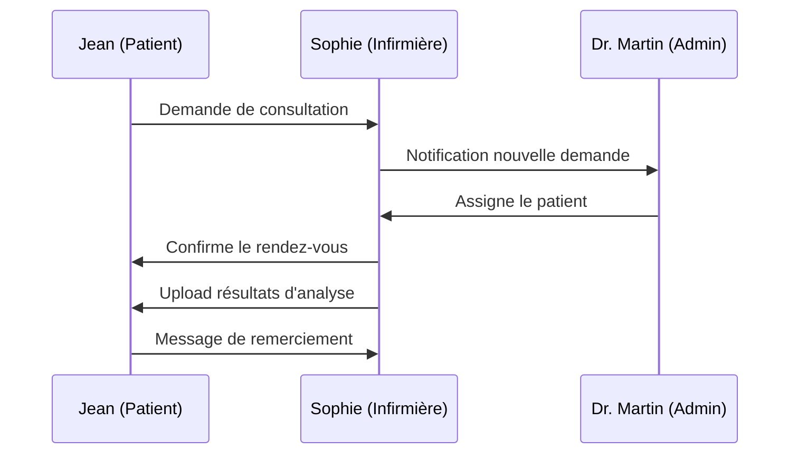
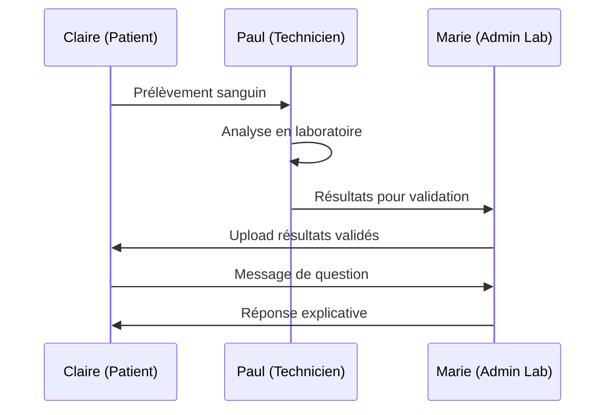

# 🏗️ ARCHITECTURE MVP EXPLIQUÉE - Structure & Scénarios d'Utilisation

## 📋 Vue d'Ensemble de la Nouvelle Structure

### 🎯 Philosophie de l'Architecture MVP

Cette nouvelle architecture suit le principe **"Simplicité d'abord"** :
- **1 table users** au lieu de 6 tables séparées
- **Relations directes** et compréhensibles
- **Données essentielles** uniquement
- **Évolutivité** préservée pour les futures fonctionnalités

---

## 🗄️ STRUCTURE DÉTAILLÉE DES TABLES

### 1. 👥 Table `users` - Cœur du Système

```sql
CREATE TABLE users (
  id            INT PRIMARY KEY AUTO_INCREMENT,
  email         VARCHAR(255) UNIQUE NOT NULL,
  password_hash VARCHAR(255) NOT NULL,
  first_name    VARCHAR(100),
  last_name     VARCHAR(100),
  phone         VARCHAR(20),
  
  -- RÔLE UNIFIÉ (6 types d'utilisateurs)
  role          ENUM('patient', 'hospital_staff', 'hospital_admin', 'lab_staff', 'lab_admin', 'super_admin'),
  
  -- RÉFÉRENCES VERS ÉTABLISSEMENTS
  hospital_id   INT NULL,      -- Pour hospital_staff et hospital_admin
  laboratory_id INT NULL,      -- Pour lab_staff et lab_admin
  
  -- STATUT
  is_active     BOOLEAN DEFAULT TRUE,
  last_seen     TIMESTAMP NULL,
  created_at    TIMESTAMP DEFAULT NOW(),
  updated_at    TIMESTAMP DEFAULT NOW() ON UPDATE NOW()
);
```

#### 🔑 Logique des Rôles

| Rôle | hospital_id | laboratory_id | Description |
|------|-------------|---------------|-------------|
| `patient` | NULL | NULL | Patient utilisant l'app |
| `hospital_staff` | ✅ SET | NULL | Médecin/infirmier d'un hôpital |
| `hospital_admin` | ✅ SET | NULL | Admin gérant un hôpital |
| `lab_staff` | NULL | ✅ SET | Technicien d'un laboratoire |
| `lab_admin` | NULL | ✅ SET | Admin gérant un laboratoire |
| `super_admin` | NULL | NULL | Admin système global |

### 2. 🏥 Tables `hospitals` & `laboratories` - Établissements

```sql
-- Hôpitaux avec géolocalisation
CREATE TABLE hospitals (
  id          INT PRIMARY KEY AUTO_INCREMENT,
  name        VARCHAR(255) NOT NULL,
  address     TEXT NOT NULL,
  city        VARCHAR(100) NOT NULL,
  phone       VARCHAR(20),
  email       VARCHAR(255),
  
  -- GÉOLOCALISATION SIMPLE
  latitude    FLOAT NULL,    -- Coordonnée GPS
  longitude   FLOAT NULL,    -- Coordonnée GPS
  
  is_active   BOOLEAN DEFAULT TRUE,
  created_at  TIMESTAMP DEFAULT NOW()
);

-- Laboratoires (structure identique)
CREATE TABLE laboratories (
  -- Structure identique aux hôpitaux
  -- Permet la recherche par proximité
);
```

### 3. 👤 Table `patients` - Profils Enrichis

```sql
CREATE TABLE patients (
  id              INT PRIMARY KEY AUTO_INCREMENT,
  user_id         INT UNIQUE NOT NULL,  -- Lien vers users
  date_of_birth   DATE NULL,
  gender          ENUM('M', 'F', 'Other') NULL,
  phone           VARCHAR(20) NULL,
  
  FOREIGN KEY (user_id) REFERENCES users(id) ON DELETE CASCADE
);
```

### 4. 📄 Table `documents` - Fichiers Médicaux

```sql
CREATE TABLE documents (
  id                INT PRIMARY KEY AUTO_INCREMENT,
  patient_id        INT NOT NULL,        -- À qui appartient le document
  uploaded_by       INT NOT NULL,        -- Qui l'a uploadé
  hospital_id       INT NULL,            -- Hôpital d'origine (optionnel)
  laboratory_id     INT NULL,            -- Laboratoire d'origine (optionnel)
  
  -- FICHIER
  filename          VARCHAR(255) NOT NULL,
  file_path         VARCHAR(500) NOT NULL,
  file_size         INT NOT NULL,
  
  -- TYPE
  document_type     ENUM('lab_result', 'prescription', 'medical_report', 'other'),
  
  created_at        TIMESTAMP DEFAULT NOW()
);
```

### 5. 💬 Tables Messagerie - Communication Simple

```sql
-- Conversations
CREATE TABLE conversations (
  id          INT PRIMARY KEY AUTO_INCREMENT,
  title       VARCHAR(255) NULL,
  created_by  INT NOT NULL,
  created_at  TIMESTAMP DEFAULT NOW()
);

-- Participants des conversations
CREATE TABLE conversation_participants (
  id              INT PRIMARY KEY AUTO_INCREMENT,
  conversation_id INT NOT NULL,
  user_id         INT NOT NULL,
  joined_at       TIMESTAMP DEFAULT NOW(),
  
  UNIQUE(conversation_id, user_id)
);

-- Messages
CREATE TABLE messages (
  id              INT PRIMARY KEY AUTO_INCREMENT,
  conversation_id INT NOT NULL,
  sender_id       INT NOT NULL,
  content         TEXT NOT NULL,
  created_at      TIMESTAMP DEFAULT NOW()
);
```

---

## 🎭 SCÉNARIOS D'UTILISATION DÉTAILLÉS

### 🏥 Scénario 1 : Gestion d'un Hôpital

#### Acteurs
- **Dr. Martin** (hospital_admin, hospital_id=1)
- **Infirmière Sophie** (hospital_staff, hospital_id=1)
- **Patient Jean** (patient)

#### Flux d'utilisation



#### Requêtes SQL typiques

```sql
-- Dr. Martin voit tous les staff de son hôpital
SELECT * FROM users 
WHERE role = 'hospital_staff' AND hospital_id = 1;

-- Sophie voit les documents de ses patients
SELECT d.*, p.first_name, p.last_name 
FROM documents d
JOIN patients pt ON d.patient_id = pt.id
JOIN users p ON pt.user_id = p.id
WHERE d.hospital_id = 1;

-- Jean voit ses documents médicaux
SELECT d.* FROM documents d
JOIN patients pt ON d.patient_id = pt.id
WHERE pt.user_id = 123;  -- ID de Jean
```

### 🧪 Scénario 2 : Laboratoire d'Analyses

#### Acteurs
- **Marie** (lab_admin, laboratory_id=2)
- **Technicien Paul** (lab_staff, laboratory_id=2)
- **Patient Claire** (patient)

#### Flux d'utilisation



#### Requêtes SQL typiques

```sql
-- Marie gère son laboratoire
SELECT * FROM users 
WHERE (role = 'lab_staff' OR role = 'lab_admin') 
AND laboratory_id = 2;

-- Paul upload un résultat
INSERT INTO documents (patient_id, uploaded_by, laboratory_id, filename, document_type)
VALUES (456, 789, 2, 'analyse_sang_claire.pdf', 'lab_result');

-- Claire reçoit ses résultats
SELECT d.*, l.name as lab_name 
FROM documents d
JOIN laboratories l ON d.laboratory_id = l.id
JOIN patients pt ON d.patient_id = pt.id
WHERE pt.user_id = 456 AND d.document_type = 'lab_result';
```

### 🌍 Scénario 3 : Recherche par Géolocalisation

#### Acteur
- **Patient Thomas** cherche un hôpital proche

#### Flux d'utilisation

```sql
-- Thomas cherche les hôpitaux dans un rayon de 10km
-- Position de Thomas : latitude=48.8566, longitude=2.3522 (Paris)

SELECT 
  h.*,
  (6371 * acos(
    cos(radians(48.8566)) * 
    cos(radians(h.latitude)) * 
    cos(radians(h.longitude) - radians(2.3522)) + 
    sin(radians(48.8566)) * 
    sin(radians(h.latitude))
  )) AS distance_km
FROM hospitals h
WHERE h.is_active = TRUE
HAVING distance_km <= 10
ORDER BY distance_km ASC
LIMIT 5;
```

### 💬 Scénario 4 : Messagerie Patient-Médecin

#### Acteurs
- **Patient Emma** (patient)
- **Dr. Dubois** (hospital_staff, hospital_id=3)

#### Flux d'utilisation

```sql
-- 1. Créer une conversation
INSERT INTO conversations (title, created_by) 
VALUES ('Consultation post-opératoire', 123);  -- ID d'Emma

-- 2. Ajouter les participants
INSERT INTO conversation_participants (conversation_id, user_id) VALUES
(1, 123),  -- Emma
(1, 456);  -- Dr. Dubois

-- 3. Emma envoie un message
INSERT INTO messages (conversation_id, sender_id, content)
VALUES (1, 123, 'Bonjour Docteur, j\'ai encore des douleurs...');

-- 4. Dr. Dubois répond
INSERT INTO messages (conversation_id, sender_id, content)
VALUES (1, 456, 'Bonjour Emma, c\'est normal après l\'opération...');

-- 5. Récupérer l'historique de la conversation
SELECT 
  m.content,
  m.created_at,
  u.first_name,
  u.last_name,
  u.role
FROM messages m
JOIN users u ON m.sender_id = u.id
WHERE m.conversation_id = 1
ORDER BY m.created_at ASC;
```

### 🔐 Scénario 5 : Super Admin - Gestion Globale

#### Acteur
- **Admin Système** (super_admin)

#### Capacités

```sql
-- Voir tous les utilisateurs du système
SELECT 
  u.role,
  COUNT(*) as count,
  h.name as hospital_name,
  l.name as lab_name
FROM users u
LEFT JOIN hospitals h ON u.hospital_id = h.id
LEFT JOIN laboratories l ON u.laboratory_id = l.id
GROUP BY u.role, h.name, l.name;

-- Statistiques globales
SELECT 
  (SELECT COUNT(*) FROM users WHERE role = 'patient') as patients,
  (SELECT COUNT(*) FROM hospitals WHERE is_active = TRUE) as hospitals,
  (SELECT COUNT(*) FROM laboratories WHERE is_active = TRUE) as laboratories,
  (SELECT COUNT(*) FROM documents) as total_documents,
  (SELECT COUNT(*) FROM messages) as total_messages;

-- Créer un nouvel admin d'hôpital
INSERT INTO users (email, password_hash, first_name, last_name, role, hospital_id)
VALUES ('admin@hopital-paris.fr', '$2b$10$...', 'Jean', 'Dupont', 'hospital_admin', 1);
```

---

## 🔄 FLUX DE DONNÉES TYPIQUES

### 1. 🔐 Authentification Unifiée

```javascript
// Connexion d'un utilisateur
async function login(email, password) {
  const user = await prisma.user.findUnique({
    where: { email },
    include: {
      hospital: true,
      laboratory: true,
      patient: true
    }
  });
  
  if (user && await bcrypt.compare(password, user.password_hash)) {
    const token = jwt.sign({
      id: user.id,
      role: user.role,
      hospital_id: user.hospital_id,
      laboratory_id: user.laboratory_id
    }, JWT_SECRET);
    
    return { user, token };
  }
  
  throw new Error('Invalid credentials');
}
```

### 2. 📄 Gestion des Documents

```javascript
// Upload d'un document par un professionnel
async function uploadDocument(patientId, uploadedBy, file, type) {
  const uploader = await prisma.user.findUnique({
    where: { id: uploadedBy }
  });
  
  const document = await prisma.document.create({
    data: {
      patient_id: patientId,
      uploaded_by: uploadedBy,
      hospital_id: uploader.hospital_id,
      laboratory_id: uploader.laboratory_id,
      filename: file.originalname,
      file_path: file.path,
      file_size: file.size,
      document_type: type
    }
  });
  
  // Notifier le patient
  await createNotification(patientId, 'Nouveau document disponible');
  
  return document;
}
```

### 3. 🗺️ Recherche Géographique

```javascript
// Recherche d'établissements par proximité
async function findNearbyEstablishments(lat, lng, radius = 10, type = 'hospital') {
  const table = type === 'hospital' ? 'hospitals' : 'laboratories';
  
  const query = `
    SELECT *,
    (6371 * acos(
      cos(radians(?)) * 
      cos(radians(latitude)) * 
      cos(radians(longitude) - radians(?)) + 
      sin(radians(?)) * 
      sin(radians(latitude))
    )) AS distance_km
    FROM ${table}
    WHERE is_active = TRUE
    HAVING distance_km <= ?
    ORDER BY distance_km ASC
    LIMIT 20
  `;
  
  return await prisma.$queryRaw(query, lat, lng, lat, radius);
}
```

### 4. 💬 Messagerie en Temps Réel

```javascript
// WebSocket pour messagerie temps réel
io.on('connection', (socket) => {
  socket.on('join_conversation', async (conversationId, userId) => {
    // Vérifier que l'utilisateur peut accéder à cette conversation
    const participant = await prisma.conversationParticipant.findFirst({
      where: {
        conversation_id: conversationId,
        user_id: userId
      }
    });
    
    if (participant) {
      socket.join(`conversation_${conversationId}`);
    }
  });
  
  socket.on('send_message', async (data) => {
    const message = await prisma.message.create({
      data: {
        conversation_id: data.conversationId,
        sender_id: data.senderId,
        content: data.content
      },
      include: {
        sender: {
          select: { first_name: true, last_name: true, role: true }
        }
      }
    });
    
    // Diffuser le message à tous les participants
    io.to(`conversation_${data.conversationId}`).emit('new_message', message);
  });
});
```

---

## 🎯 AVANTAGES DE CETTE STRUCTURE

### 1. 🚀 Simplicité de Développement

```javascript
// AVANT (6 tables) - Complexe
async function getUser(email) {
  // Chercher dans 6 tables différentes
  let user = await prisma.admin.findUnique({ where: { email } });
  if (!user) user = await prisma.patient.findUnique({ where: { email } });
  if (!user) user = await prisma.hospitalAdmin.findUnique({ where: { email } });
  // ... 3 autres tables
  return user;
}

// APRÈS (1 table) - Simple
async function getUser(email) {
  return await prisma.user.findUnique({ 
    where: { email },
    include: { hospital: true, laboratory: true, patient: true }
  });
}
```

### 2. 🔍 Requêtes Optimisées

```sql
-- Une seule requête pour tous les utilisateurs d'un établissement
SELECT u.*, p.date_of_birth, p.gender 
FROM users u
LEFT JOIN patients p ON u.id = p.user_id
WHERE u.hospital_id = 1
ORDER BY u.role, u.last_name;
```

### 3. 🔐 Gestion des Permissions Simplifiée

```javascript
// Middleware de vérification des permissions
function checkPermission(requiredRole, establishmentType = null) {
  return (req, res, next) => {
    const { role, hospital_id, laboratory_id } = req.user;
    
    // Vérification du rôle
    if (!hasPermission(role, requiredRole)) {
      return res.status(403).json({ error: 'Insufficient permissions' });
    }
    
    // Vérification de l'établissement si nécessaire
    if (establishmentType === 'hospital' && !hospital_id) {
      return res.status(403).json({ error: 'Hospital access required' });
    }
    
    if (establishmentType === 'laboratory' && !laboratory_id) {
      return res.status(403).json({ error: 'Laboratory access required' });
    }
    
    next();
  };
}

// Utilisation
app.get('/api/hospital/staff', 
  authenticateToken,
  checkPermission('hospital_admin', 'hospital'),
  getHospitalStaff
);
```

---

## 🚀 ÉVOLUTIVITÉ FUTURE

### Phase 2 : Fonctionnalités Avancées

```sql
-- Ajouter des colonnes sans casser l'existant
ALTER TABLE users ADD COLUMN profile_picture TEXT NULL;
ALTER TABLE users ADD COLUMN preferences JSON NULL;
ALTER TABLE users ADD COLUMN last_login TIMESTAMP NULL;

-- Nouvelles tables pour fonctionnalités avancées
CREATE TABLE notifications (
  id INT PRIMARY KEY AUTO_INCREMENT,
  user_id INT NOT NULL,
  title VARCHAR(255),
  content TEXT,
  read_at TIMESTAMP NULL,
  created_at TIMESTAMP DEFAULT NOW(),
  FOREIGN KEY (user_id) REFERENCES users(id)
);

CREATE TABLE appointments (
  id INT PRIMARY KEY AUTO_INCREMENT,
  patient_id INT NOT NULL,
  provider_id INT NOT NULL,
  hospital_id INT NULL,
  laboratory_id INT NULL,
  scheduled_date TIMESTAMP NOT NULL,
  status ENUM('scheduled', 'completed', 'cancelled') DEFAULT 'scheduled',
  FOREIGN KEY (patient_id) REFERENCES users(id),
  FOREIGN KEY (provider_id) REFERENCES users(id)
);
```

Cette architecture MVP offre une base solide, simple à comprendre et à maintenir, tout en préservant la possibilité d'évolution future ! 🎉