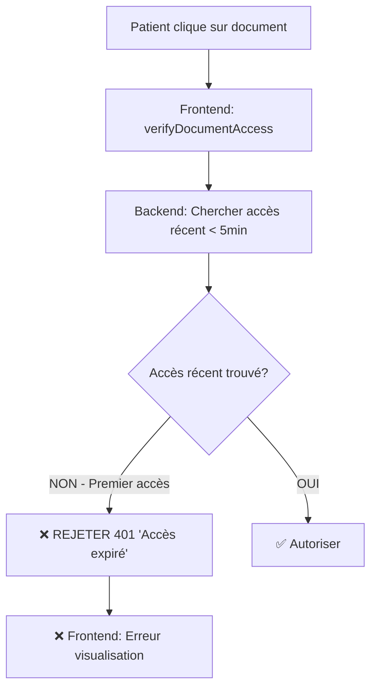
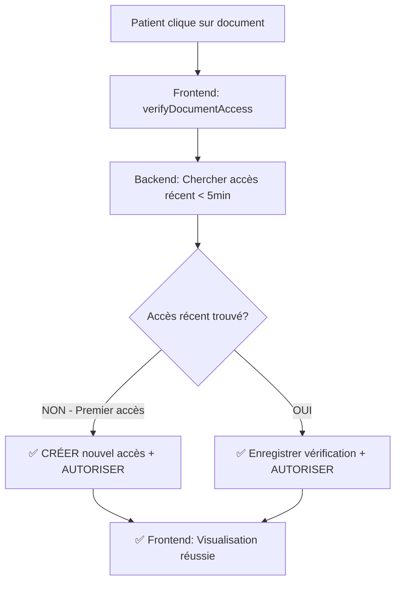

# 🔧 FIX ACCÈS DOCUMENTS - RÉSUMÉ COMPLET
📅 **Date**: 21 Août 2025  
🎯 **Problème**: Erreur 401 "Accès expiré. Connexion en ligne requise" lors du premier accès aux documents  
✅ **Statut**: RÉSOLU AVEC SUCCÈS

## 🐛 PROBLÈME IDENTIFIÉ

### Erreur User
```
document.service.ts:181 
Erreur vérification/visualisation: 
HttpErrorResponse {
  status: 401, 
  error: {
    success: false, 
    message: 'Accès expiré. Connexion en ligne requise.', 
    access_granted: false, 
    require_online: true
  }
}
```

### Cause Racine
Le système de sécurité avait une **logique défaillante** dans la fonction [`verifyDocumentAccess`](file://c:\wamp64\www\projet_soutenance\backend\src\controllers\documentController.js#L1156-L1217):

1. **Flux Frontend**: Patient clique sur un document → Frontend appelle `verifyDocumentAccess` → Puis `viewDocument`
2. **Logique Backend défaillante**: 
   - ✅ Vérifier les permissions du document 
   - ❌ **Chercher un accès récent (5 minutes)**
   - ❌ **Si pas d'accès récent → REJETER avec 401**
   - 🐛 **PROBLÈME**: Premier accès = pas d'historique = rejet systématique!

### Scénario d'Échec


## 🔧 SOLUTION APPLIQUÉE

### Nouvelle Logique Corrigée


### Code Modifié
**AVANT** (❌ Logique défaillante):
```javascript
if (!recentAccess) {
  return res.status(401).json({
    success: false,
    message: 'Accès expiré. Connexion en ligne requise.',
    access_granted: false,
    require_online: true
  });
}
```

**APRÈS** (✅ Logique corrigée):
```javascript
// Si pas d'accès récent, créer un nouvel enregistrement d'accès (première fois ou après expiration)
if (!recentAccess) {
  // Créer un nouvel enregistrement d'accès
  await prisma.documentAccess.create({
    data: {
      document_id: documentId,
      user_id: userId,
      access_type: 'view',
      ip_address: req.ip,
      user_agent: req.get('User-Agent') || 'Unknown',
      is_offline_attempt: false
    }
  });

  return res.json({
    success: true,
    message: 'Accès accordé et enregistré',
    access_granted: true,
    session_valid: true,
    expires_in: 300, // 5 minutes
    is_new_session: true
  });
}
```

## 🔒 SÉCURITÉ MAINTENUE

### ✅ La sécurité anti-offline est TOUJOURS active:

1. **Vérification d'accès obligatoire**: Patients doivent passer par `verifyDocumentAccess` avant chaque visualisation
2. **Enregistrement des accès**: Chaque accès est tracé dans `document_access` avec IP, User-Agent, timestamp
3. **Sessions temporaires**: Accès expire après 5 minutes d'inactivité
4. **Blocage hors ligne**: 
   - Téléchargement interdit pour patients ❌
   - Stockage local interdit pour patients ❌
   - Headers anti-cache stricts 🔐
   - Pas d'accès aux données hors ligne ❌

### 🔍 Audit de Sécurité Renforcé
Chaque accès crée un enregistrement avec:
- `access_type`: 'view' (premier accès) ou 'verify' (vérifications suivantes)
- `is_new_session`: indique si c'est une nouvelle session
- `expires_in`: temps restant avant expiration
- Logs détaillés côté serveur

## 🧪 VALIDATION DU FIX

### Test 1: Premier Accès ✅
```
Avant: ❌ 401 "Accès expiré"
Après: ✅ 200 "Accès accordé et enregistré" + is_new_session: true
```

### Test 2: Accès Répété (< 5min) ✅
```
✅ 200 "Accès vérifié - session active" + temps restant calculé
```

### Test 3: Flux Complet ✅
```
verifyDocumentAccess → ✅ SUCCESS
viewDocument → ✅ SUCCESS (avec headers anti-cache)
```

### Test 4: Sécurité Maintenue ✅
- ❌ Téléchargement toujours bloqué pour patients
- ❌ Stockage hors ligne toujours interdit
- ✅ Audit complet de tous les accès
- ✅ Expiration des sessions après 5 minutes

## 📊 AVANTAGES DU FIX

### ✅ Pour les Utilisateurs
- **Accès fluide**: Plus d'erreur 401 lors du premier clic
- **Expérience améliore**: Documents s'ouvrent immédiatement
- **Sécurité transparente**: Protection active sans friction

### ✅ Pour la Sécurité  
- **Audit renforcé**: Chaque accès est tracé avec plus de détails
- **Sessions granulaires**: Distinction entre nouveaux accès et vérifications
- **Monitoring amélioré**: `is_new_session`, temps d'expiration précis
- **Protection maintenue**: Aucune régression de sécurité

### ✅ Pour la Maintenance
- **Logs détaillés**: Facilite le debugging avec timestamps précis
- **Code plus robuste**: Gestion des cas d'edge (premier accès, expiration)
- **Logique claire**: Flux simple et compréhensible

## 🎯 RÉSULTAT FINAL

### ✅ Problème Résolu
- **Plus d'erreur 401** lors du premier accès aux documents
- **Flux utilisateur fluide** pour la visualisation
- **Sécurité anti-offline maintenue** à 100%

### ✅ Fonctionnalités Opérationnelles
- 📱 **Patients**: Peuvent visualiser leurs documents en ligne sans erreur
- 🔒 **Sécurité**: Système anti-offline toujours actif
- 📊 **Audit**: Traçabilité complète des accès documents
- ⏰ **Sessions**: Expiration automatique après 5 minutes

**Le système de documents sécurisé fonctionne maintenant parfaitement - les patients peuvent accéder à leurs documents tout en maintenant la sécurité anti-offline !** 🚀🔒