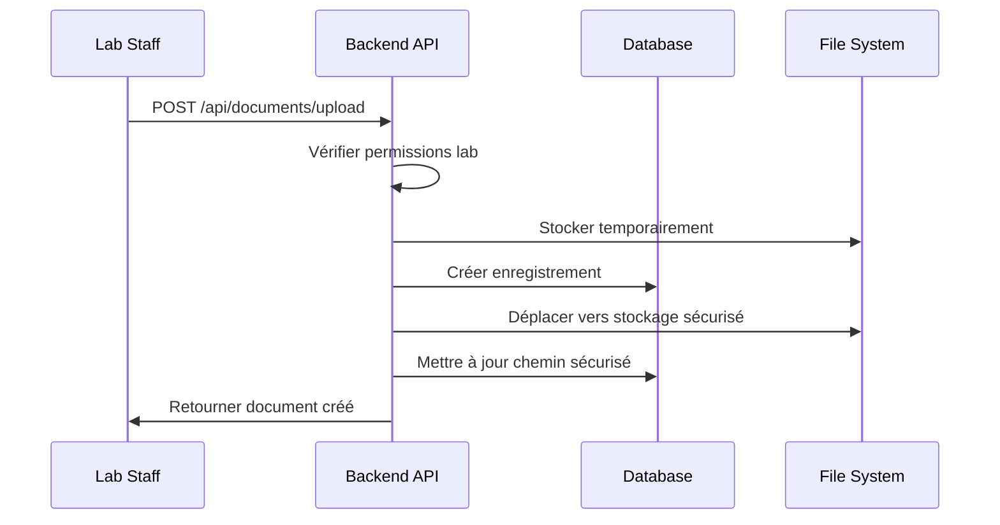
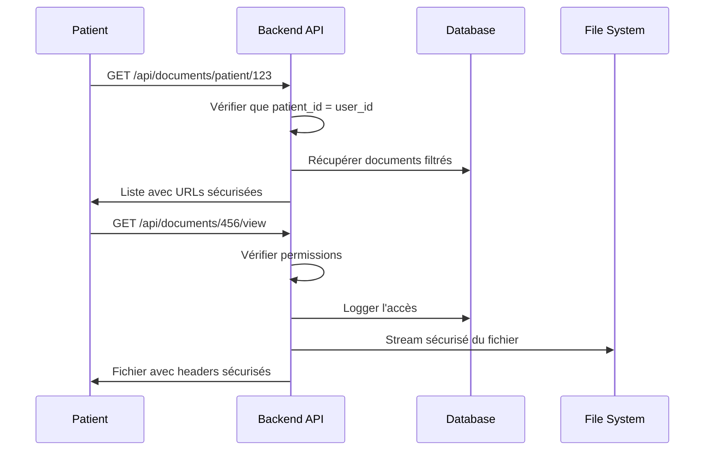
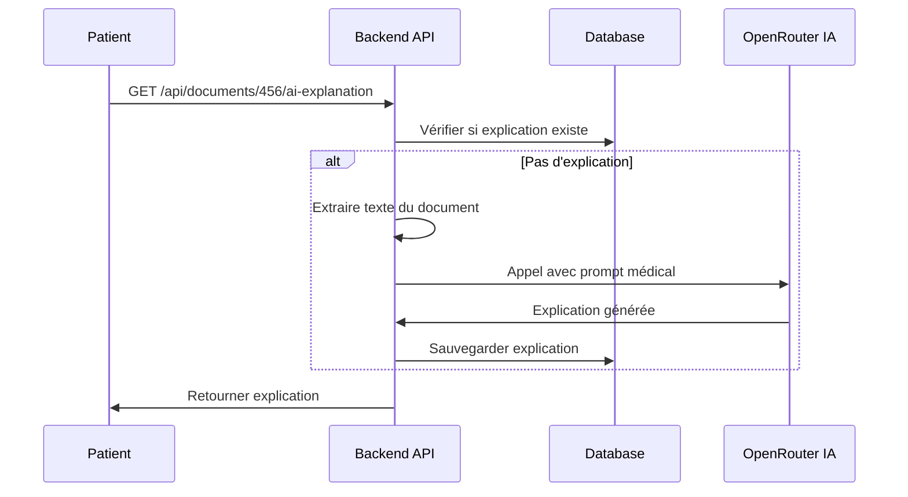

# 📄 Logique Backend - Gestion des Documents et Patients

## 🎯 Vue d'ensemble

Le système de gestion des documents médicaux est conçu avec une approche sécurisée et multi-rôles. Voici comment tout fonctionne ensemble.

## 🏗️ Architecture des Documents

### 📊 Modèle de données (Prisma Schema)

```prisma
model Document {
  id                Int         @id @default(autoincrement())
  patient_id        Int         // Lien vers le patient propriétaire
  uploaded_by       Int         // Qui a uploadé le document
  hospital_id       Int?        // Hôpital associé (optionnel)
  laboratory_id     Int?        // Laboratoire associé (optionnel)
  
  // Informations fichier
  filename          String      // Nom original du fichier
  file_path         String      // Chemin sécurisé sur le serveur
  file_size         Int         // Taille en bytes
  secure_filename   String?     // Nom chiffré pour sécurité
  secure_token      String?     // Token d'accès sécurisé
  
  // Métadonnées
  document_type     DocumentType // Type: lab_result, prescription, medical_report, other
  description       String?     // Description optionnelle
  shared_with       String?     // JSON des IDs utilisateurs autorisés
  
  // Relations
  patient           Patient     // Propriétaire du document
  uploader          User        // Qui a uploadé
  hospital          Hospital?   // Hôpital associé
  laboratory        Laboratory? // Laboratoire associé
  ai_explanation    DocumentAIExplanation? // Explication IA
  access_logs       DocumentAccess[] // Logs d'accès
}
```

## 🔐 Système de Permissions

### 👥 Rôles et Accès

#### 1. **Patient** (`role: 'patient'`)
- ✅ **Peut voir** : Ses propres documents uniquement
- ✅ **Peut uploader** : Documents pour lui-même
- ✅ **Peut demander** : Explications IA de ses documents
- ❌ **Ne peut pas** : Télécharger directement (visualisation sécurisée uniquement)
- ❌ **Ne peut pas** : Voir les documents d'autres patients

#### 2. **Personnel Hospitalier** (`role: 'hospital_staff'`)
- ✅ **Peut voir** : Documents des patients de son hôpital
- ✅ **Peut uploader** : Documents pour les patients de son hôpital
- ✅ **Peut télécharger** : Documents de son hôpital
- ✅ **Peut supprimer** : Ses propres uploads uniquement
- ❌ **Ne peut pas** : Accéder aux documents d'autres hôpitaux

#### 3. **Admin Hospitalier** (`role: 'hospital_admin'`)
- ✅ **Peut tout faire** : Comme le personnel + gestion complète
- ✅ **Peut supprimer** : Tous les documents de son hôpital
- ✅ **Peut gérer** : Les patients de son hôpital

#### 4. **Personnel/Admin Laboratoire** (`role: 'lab_staff'/'lab_admin'`)
- ✅ **Peut voir** : Documents des patients de son laboratoire
- ✅ **Peut uploader** : Résultats d'analyses pour tous les patients
- ✅ **Logique spéciale** : Peut créer des documents pour n'importe quel patient (résultats d'analyses)

#### 5. **Super Admin** (`role: 'super_admin'`)
- ✅ **Accès total** : Tous les documents, tous les patients
- ✅ **Gestion complète** : Création, modification, suppression

## 🚀 Endpoints et Logique

### 1. 📤 **Upload de Document** - `POST /api/documents/upload`

```javascript
// Logique de permissions
if (role === 'patient') {
  // Patient ne peut uploader que pour lui-même
  canUpload = (patient.user_id === uploaderId);
} else if (role === 'hospital_staff' || role === 'hospital_admin') {
  // Staff hospitalier pour les patients de son hôpital
  canUpload = true;
  assignedHospitalId = hospital_id;
} else if (role === 'lab_staff' || role === 'lab_admin') {
  // Staff labo peut uploader pour tous les patients
  canUpload = true;
  assignedLabId = laboratory_id;
}
```

**Processus sécurisé :**
1. **Validation** : Type de fichier, taille, permissions
2. **Stockage temporaire** : Multer avec nom sécurisé
3. **Création en base** : Enregistrement avec token sécurisé
4. **Chiffrement** : Nom de fichier chiffré avec SHA256
5. **Déplacement sécurisé** : Vers dossier protégé
6. **Nettoyage** : Suppression du fichier temporaire

### 2. 📋 **Liste des Documents** - `GET /api/documents/patient/:id`

```javascript
// Logique de filtrage par rôle
let whereClause = { patient_id: patientId };

if (role === 'hospital_staff') {
  // Seulement les documents de son hôpital
  whereClause.hospital_id = hospital_id;
} else if (role === 'lab_staff') {
  // Seulement les documents de son laboratoire
  whereClause.laboratory_id = laboratory_id;
} else if (role === 'patient') {
  // Seulement ses propres documents
  if (patient.user_id !== userId) return 403;
}
```

**Fonctionnalités :**
- ✅ **Pagination** : Page/limite configurable
- ✅ **Filtrage** : Par type de document
- ✅ **Recherche** : Dans nom de fichier et description
- ✅ **URLs sécurisées** : Liens de visualisation protégés

### 3. 👁️ **Visualisation Sécurisée** - `GET /api/documents/:id/view`

```javascript
// Vérification d'accès multi-niveaux
let canAccess = false;

if (role === 'patient') {
  canAccess = (document.patient.user_id === userId);
} else if (role === 'hospital_staff') {
  canAccess = (document.hospital_id === hospital_id);
} else if (role === 'lab_staff') {
  canAccess = (document.laboratory_id === laboratory_id);
}
```

**Sécurité renforcée :**
- 🔒 **Headers sécurisés** : X-Content-Type-Options, X-Frame-Options
- 📊 **Audit complet** : Logs d'accès avec IP, User-Agent
- 🚫 **Pas de téléchargement direct** : Pour les patients (visualisation uniquement)
- 🔄 **Streaming sécurisé** : Pas de stockage en mémoire

### 4. 🤖 **Explication IA** - `GET /api/documents/:id/ai-explanation`

```javascript
// Réservé aux patients uniquement
if (role !== 'patient') {
  return res.status(403).json({
    message: 'Fonctionnalité réservée aux patients'
  });
}
```

**Processus IA :**
1. **Extraction de texte** : Du document (PDF, images, texte)
2. **Appel OpenRouter** : API IA avec prompt médical spécialisé
3. **Cache intelligent** : Sauvegarde de l'explication générée
4. **Réponse structurée** : Résumé, points importants, recommandations

## 🏥 Endpoints Patients (Admin)

### 📊 **Gestion Administrative** - `/api/admin/patients/*`

#### Permissions par rôle :

```javascript
// Super Admin
✅ Peut tout faire sur tous les patients

// Hospital Admin  
✅ Peut gérer les patients de son hôpital uniquement
whereClause.hospital_id = adminHospitalId;

// Lab Admin
✅ Peut gérer les patients de son laboratoire uniquement  
whereClause.laboratory_id = adminLabId;
```

#### Endpoints principaux :

1. **`GET /api/admin/patients`** - Liste paginée avec filtres
2. **`POST /api/admin/patients`** - Création avec assignation automatique
3. **`GET /api/admin/patients/:id`** - Détails + documents récents
4. **`PUT /api/admin/patients/:id`** - Modification avec restrictions
5. **`DELETE /api/admin/patients/:id`** - Suppression avec vérifications
6. **`GET /api/admin/patients/stats`** - Statistiques par établissement

## 🔄 Flux de Données Typiques

### 📤 **Scénario 1 : Upload par un Laboratoire**



### 👁️ **Scénario 2 : Patient consulte ses documents**



### 🤖 **Scénario 3 : Demande d'explication IA**



## 🛡️ Sécurité et Audit

### 🔒 **Mesures de Sécurité**

1. **Stockage sécurisé** :
   - Fichiers dans dossier protégé hors web root
   - Noms de fichiers chiffrés (SHA256)
   - Tokens d'accès uniques

2. **Permissions strictes** :
   - Vérification à chaque endpoint
   - Filtrage par établissement
   - Logs d'accès complets

3. **Validation robuste** :
   - Types de fichiers autorisés
   - Taille maximale (25MB)
   - Sanitisation des noms

### 📊 **Audit et Traçabilité**

```javascript
// Chaque accès est loggé
await prisma.documentAccess.create({
  data: {
    document_id: documentId,
    user_id: userId,
    access_type: 'view' | 'download',
    ip_address: req.ip,
    user_agent: req.get('User-Agent'),
    accessed_at: new Date()
  }
});
```

## 🚀 Points Clés à Retenir

### ✅ **Avantages du Système**

1. **Sécurité maximale** : Permissions granulaires, stockage chiffré
2. **Flexibilité** : Support multi-établissements
3. **Audit complet** : Traçabilité de tous les accès
4. **IA intégrée** : Explications automatiques pour patients
5. **Scalabilité** : Architecture modulaire et extensible

### 🔧 **Améliorations Possibles**

1. **Chiffrement des fichiers** : Chiffrer le contenu, pas seulement le nom
2. **Signatures électroniques** : Pour l'intégrité des documents
3. **OCR avancé** : Extraction de texte plus sophistiquée
4. **Notifications** : Alertes lors d'upload/consultation
5. **Versioning** : Historique des modifications

---

Cette architecture garantit une gestion sécurisée et conforme des documents médicaux tout en offrant une expérience utilisateur optimale pour chaque type d'utilisateur ! 🏥✨